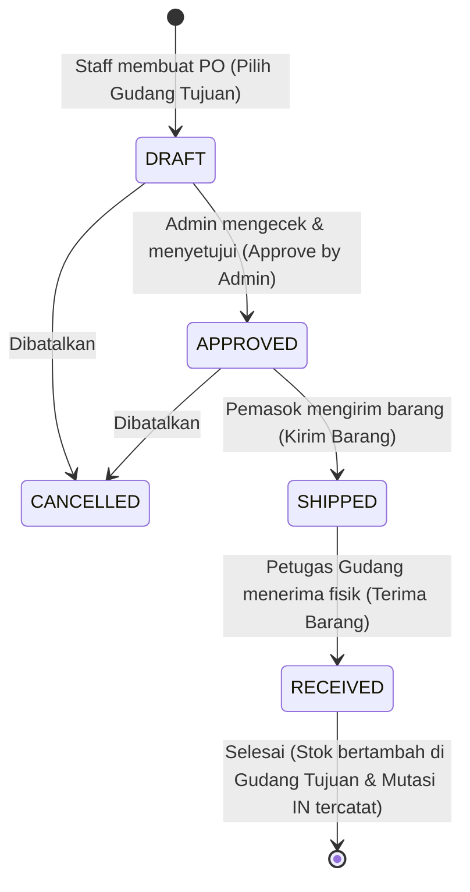
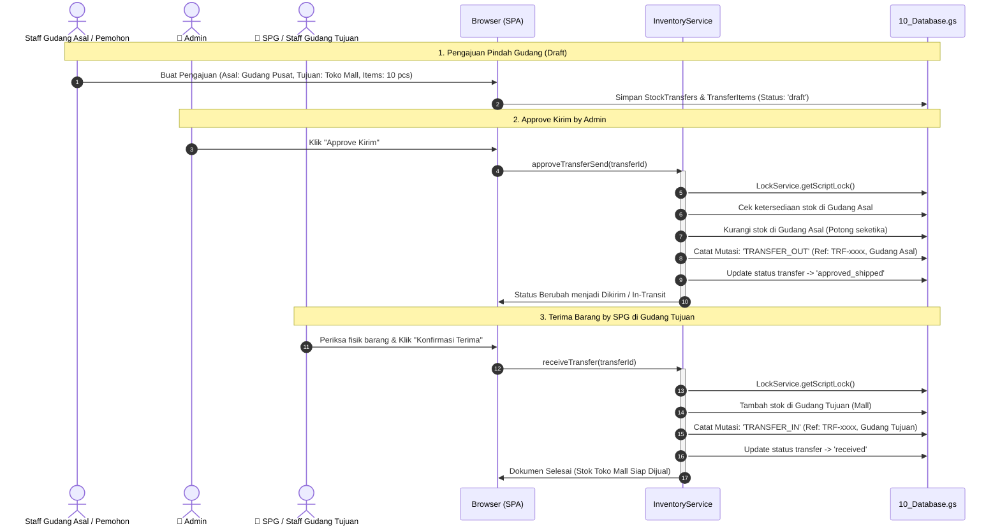
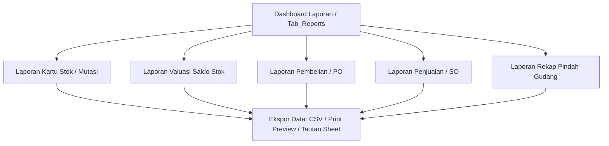

# 📋 MASTER PLAN & TECHNICAL ROADMAP
## Supply Chain, Multi-Gudang, Mutasi Stok, Order (PO & SO), Pindah Gudang (Approval Berjenjang), dan Sistem Laporan

Dokumen ini adalah **Master Blueprint & Technical Debt Tracker** untuk pengembangan ekosistem rantai pasok (Supply Chain & Inventory Lite) pada **GAS Modular CRUD Framework**. Dokumen ini dirancang untuk menjadi acuan teknis jangka panjang, panduan implementasi bertahap, serta pencatatan potensi utang teknis (*technical debt*) dan mitigasinya.

---

## 🏛️ 1. Prinsip Arsitektur & Kepatuhan Konvensi

Berdasarkan dokumen `AGENTS.md`, seluruh modul baru **WAJIB** tunduk pada aturan berikut:

1. **Schema sebagai Single Source of Truth:**
   - Semua metadata kolom, tipe data, validasi, pencarian, dan tampilan formulir didefinisikan secara deklaratif di `01_Schema.gs` (backend) dan `01_Schema_Frontend.html` (frontend).
2. **Deep Modules & Generic Leverage:**
   - Gunakan `10_Database.gs` dan `11_Repository.gs` untuk operasi CRUD umum.
   - Modul service spesifik hanya dibuat untuk logika bisnis kompleks (misal: siklus approval berjenjang, kalkulasi stok atomik, dan agregasi data laporan).
3. **Zero Spreadsheet Coordinates Leakage:**
   - Dilarang keras mereferensikan koordinat sel (`A1`, `row[0]`, `row[1]`). Seluruh pertukaran data berbasis Object JavaScript dengan dynamic Header Mapping.
4. **Automated RAM Caching & Konsistensi Transaksi:**
   - Semua mutasi database wajib melewati `10_Database.gs` agar `CacheService` otomatis di-invalidate.
   - Operasi yang mengubah kuantitas stok atau status transaksi wajib diproteksi menggunakan `LockService.getScriptLock()` untuk mencegah *race conditions*.
5. **Runtime-Native GAS (No Heavy Build):**
   - Vanilla JS (ES6+) dan Tailwind CSS (CDN). Tanpa React/Vue, bundler, atau dependensi Node.js di sisi client.

---

## 🗄️ 2. Spesifikasi Entitas & Desain Skema Database (Sheets)

### 2.1. Entitas: Kategori Produk (`Categories`)
- **Sheet Name:** `Categories`
- **ID Prefix:** `CAT` (Contoh: `CAT-000001`)
- **Struktur Kolom:**
  | Kolom | Tipe | Keterangan | Validasi / Aturan |
  | :--- | :--- | :--- | :--- |
  | `id` | string | ID Unik Kategori | Primary Key, Auto-generated |
  | `code` | string | Kode Singkat Kategori | Unik, misal: `ELK`, `FNB`, `ATK` |
  | `name` | string | Nama Kategori | Wajib diisi, Searchable |
  | `description` | string | Deskripsi / Catatan | Opsional |
  | `created_at` | string | Timestamp ISO Pembuatan | Otomatis |
  | `updated_at` | string | Timestamp ISO Pembaruan | Otomatis |

### 2.2. Entitas: Pembaruan Produk (`Products`)
- **Sheet Name:** `Products`
- **ID Prefix:** `PRD` (Contoh: `PRD-000001`)
- **Kolom Baru & Penyesuaian:**
  - Tambah kolom `category_id` (Relasi ke `Categories.id`).
  - Tambah kolom `unit` (Satuan barang: `pcs`, `box`, `kg`, dll).
  - Tambah kolom `cost_price` (Harga modal / HPP beli).
  - Tambah kolom `min_stock` (Ambang batas minimum peringatan stok menipis).
  - Kolom `stock` mencerminkan total agregat saldo dari seluruh gudang.

### 2.3. Entitas: Gudang (`Warehouses`)
- **Sheet Name:** `Warehouses`
- **ID Prefix:** `WH` (Contoh: `WH-000001`)
- **Struktur Kolom:**
  | Kolom | Tipe | Keterangan | Validasi / Aturan |
  | :--- | :--- | :--- | :--- |
  | `id` | string | ID Unik Gudang | Primary Key, Auto-generated |
  | `code` | string | Kode Gudang | Unik, misal: `GDG-JKT`, `GDG-SBY` |
  | `name` | string | Nama Gudang / Cabang / Toko | Wajib diisi |
  | `address` | string | Alamat Fisik / Lokasi | Opsional |
  | `status` | string | Status Operasional | `active` / `inactive` |
  | `created_at` | string | Timestamp ISO Pembuatan | Otomatis |
  | `updated_at` | string | Timestamp ISO Pembaruan | Otomatis |

### 2.4. Entitas: Saldo Stok per Gudang (`Stocks`)
- **Sheet Name:** `Stocks`
- **ID Prefix:** `STK` (Contoh: `STK-000001`)
- **Struktur Kolom:**
  | Kolom | Tipe | Keterangan | Validasi / Aturan |
  | :--- | :--- | :--- | :--- |
  | `id` | string | ID Unik Rekaman Saldo | Primary Key |
  | `warehouse_id` | string | Relasi ke `Warehouses.id` | Foreign Key, Wajib |
  | `product_id` | string | Relasi ke `Products.id` | Foreign Key, Wajib |
  | `quantity` | number | Jumlah Stok Fisik di Gudang ini | Bilangan riil/bulat (>= 0) |
  | `updated_at` | string | Waktu Sinkronisasi Terakhir | Otomatis |

### 2.5. Entitas: Riwayat Mutasi Stok (`StockMutations`)
- **Sheet Name:** `StockMutations`
- **ID Prefix:** `MUT` (Contoh: `MUT-000001`)
- **Prinsip:** *Immutable Ledger* (Buku besar tidak dapat diedit atau dihapus).
- **Struktur Kolom:**
  | Kolom | Tipe | Keterangan | Validasi / Aturan |
  | :--- | :--- | :--- | :--- |
  | `id` | string | ID Mutasi | Primary Key |
  | `date` | string | Tanggal & Waktu Mutasi | Timestamp ISO |
  | `type` | string | Jenis Mutasi | `IN`, `OUT`, `TRANSFER_OUT`, `TRANSFER_IN`, `ADJUSTMENT` |
  | `reference_type`| string | Sumber Transaksi | `PO`, `SO`, `TRANSFER`, `OPNAME`, `MANUAL` |
  | `reference_id` | string | ID Dokumen Sumber | ID Order / ID Transfer |
  | `product_id` | string | ID Barang yang Berpindah | Foreign Key ke `Products` |
  | `warehouse_id` | string | Gudang Sasaran / Terdampak | Foreign Key ke `Warehouses` |
  | `quantity` | number | Jumlah Barang | Selalu bernilai positif |
  | `notes` | string | Alasan / Catatan Mutasi | Keterangan tambahan |
  | `created_by` | string | Aktor Pembuat Mutasi | Email pengguna sesi |

### 2.6. Entitas: Pesanan Transaksi Purchase Order & Sales Order (`Orders`)
- **Sheet Name:** `Orders`
- **ID Prefix:** `ORD` (atau `PO` / `SO` sesuai jenis)
- **Spesifikasi Khusus Purchase Order (PO):**
  - **Hanya Membutuhkan Gudang Tujuan** (`destination_warehouse_id` / gudang penerima barang dari pemasok luar). Tidak memerlukan gudang asal.
  - **Alur Status Bertahap:**
    `draft` $\rightarrow$ `approved` (Approve by Admin) $\rightarrow$ `shipped` (Kirim Barang oleh Supplier) $\rightarrow$ `received` (Terima Barang di Gudang Tujuan $\rightarrow$ Stok Bertambah).
- **Struktur Kolom:**
  | Kolom | Tipe | Keterangan | Validasi / Aturan |
  | :--- | :--- | :--- | :--- |
  | `id` | string | ID Dokumen | Primary Key |
  | `order_no` | string | Nomor Faktur / PO / SO | Misal: `PO-2026-0001`, `SO-2026-0001` |
  | `type` | string | Jenis Transaksi | `PURCHASE` / `SALES` |
  | `date` | string | Tanggal Faktur | Format YYYY-MM-DD |
  | `destination_warehouse_id` | string | **Gudang Tujuan** (PO) atau Gudang Pengirim (SO) | Foreign Key ke `Warehouses` |
  | `contact_name` | string | Supplier (PO) atau Customer (SO) | Nama vendor / pelanggan |
  | `total_amount` | number | Total Nilai Transaksi | Akumulasi subtotal rincian |
  | `status` | string | Status Siklus Pesanan | `draft`, `approved`, `shipped`, `received`, `cancelled` |
  | `approved_by` | string | Email Admin yang menyetujui | Terisi saat status `approved` |
  | `approved_at` | string | Timestamp Approval Admin | Terisi saat status `approved` |
  | `received_by` | string | Email Petugas yang menerima | Terisi saat status `received` |
  | `received_at` | string | Timestamp Penerimaan Fisik | Terisi saat status `received` |
  | `notes` | string | Catatan / Alamat Pengiriman | Opsional |
  | `created_by` | string | Pembuat Dokumen | Email pengguna sesi |
  | `created_at` | string | Timestamp Pembuatan | Otomatis |

### 2.7. Entitas: Rincian Barang Pesanan (`OrderItems`)
- **Sheet Name:** `OrderItems`
- **ID Prefix:** `ITM` (Contoh: `ITM-000001`)
- **Struktur Kolom:**
  | Kolom | Tipe | Keterangan | Validasi / Aturan |
  | :--- | :--- | :--- | :--- |
  | `id` | string | ID Item | Primary Key |
  | `order_id` | string | Relasi ke `Orders.id` | Foreign Key |
  | `product_id` | string | Relasi ke `Products.id` | Foreign Key |
  | `quantity` | number | Jumlah Qty | > 0 |
  | `price` | number | Harga Satuan (Beli/Jual) | Nilai nominal |
  | `subtotal` | number | Nilai Total Baris | `quantity * price` |

### 2.8. Entitas: Pindah Gudang / Transfer Stok Antar Gudang (`StockTransfers`)
- **Sheet Name:** `StockTransfers`
- **ID Prefix:** `TRF` (Contoh: `TRF-000001`)
- **Karakteristik Utama:**
  - Memiliki **Gudang Asal** (`source_warehouse_id`) dan **Gudang Tujuan** (`destination_warehouse_id`).
  - **Approve Kirim by Admin:** Admin menyetujui transfer $\rightarrow$ stok gudang asal langsung dipotong, status berubah menjadi `shipped` (*in-transit*).
  - **Terima Barang by SPG / Staff Gudang Tujuan:** SPG/Staff di gudang tujuan menerima barang fisik $\rightarrow$ stok gudang tujuan bertambah, status menjadi `received` / `completed`.
- **Struktur Kolom:**
  | Kolom | Tipe | Keterangan | Validasi / Aturan |
  | :--- | :--- | :--- | :--- |
  | `id` | string | ID Transfer | Primary Key |
  | `transfer_no` | string | Nomor Dokumen Transfer | Misal: `TRF-2026-0001` |
  | `date` | string | Tanggal Pengajuan | Format YYYY-MM-DD |
  | `source_warehouse_id` | string | **Gudang Asal** | Foreign Key ke `Warehouses` |
  | `destination_warehouse_id` | string | **Gudang Tujuan** | Foreign Key ke `Warehouses` |
  | `status` | string | Siklus Status | `draft`, `approved_shipped`, `received`, `cancelled` |
  | `approved_by` | string | Email **Admin** yang approve kirim | Terisi saat Admin approve kirim |
  | `approved_at` | string | Timestamp Approve Kirim | ISO Timestamp |
  | `received_by` | string | Email **SPG / Staff** gudang tujuan | Terisi saat SPG konfirmasi terima |
  | `received_at` | string | Timestamp Terima Barang | ISO Timestamp |
  | `notes` | string | Catatan / Alasan Pindah Gudang | Opsional |
  | `created_by` | string | Pembuat Pengajuan | Email pengguna sesi |
  | `created_at` | string | Timestamp Pembuatan | Otomatis |

### 2.9. Entitas: Rincian Barang Pindah Gudang (`TransferItems`)
- **Sheet Name:** `TransferItems`
- **ID Prefix:** `TFI` (Contoh: `TFI-000001`)
- **Struktur Kolom:**
  | Kolom | Tipe | Keterangan | Validasi / Aturan |
  | :--- | :--- | :--- | :--- |
  | `id` | string | ID Item Transfer | Primary Key |
  | `transfer_id` | string | Relasi ke `StockTransfers.id` | Foreign Key |
  | `product_id` | string | Relasi ke `Products.id` | Foreign Key |
  | `quantity` | number | Jumlah Qty yang Dipindahkan | > 0 |

---

## 🗺️ 3. Diagram Alur Data & State Machine

### 3.1. Alur Siklus Purchase Order (PO): Approve Admin $\rightarrow$ Kirim $\rightarrow$ Terima

### 3.2. Alur Siklus Pindah Gudang: Approve Kirim (Admin) $\rightarrow$ Terima (SPG)

---

## 📊 4. Spesifikasi Modul Laporan (Reporting Engine)

Modul laporan dirancang untuk memberikan visibilitas bisnis lengkap tanpa membebani performa spreadsheet:

### 4.1. Laporan Mutasi & Kartu Stok (Stock Card Report)
- **Tujuan:** Mengetahui riwayat arus masuk dan keluar barang tertentu di gudang tertentu.
- **Filter:** Rentang tanggal (`from_date` s.d. `to_date`), Pilihan Gudang, Pilihan Produk.
- **Kolom Tampilan:**
  `Tanggal | No Referensi | Tipe (IN / OUT / TRANSFER_OUT / TRANSFER_IN / ADJUSTMENT) | Masuk | Keluar | Saldo Akhir | Catatan | Aktor`

### 4.2. Laporan Valuasi Saldo Stok (Stock Valuation Report)
- **Tujuan:** Menghitung nilai aset inventaris perusahaan secara riil per gudang atau konsolidasi.
- **Filter:** Pilihan Gudang, Kategori Produk.
- **Kalkulasi:** `Nilai Aset = Quantity x Cost Price (Harga Modal)`.
- **Kolom Tampilan:**
  `Kode Produk | Nama Produk | Kategori | Gudang | Saldo Qty | Harga Pokok | Total Nilai Aset`

### 4.3. Laporan Pembelian (Purchase Order Report)
- **Tujuan:** Rekapitulasi pengadaan barang dan biaya pembelian.
- **Filter:** Rentang tanggal, Supplier, Status (Draft/Approved/Shipped/Received), Gudang Penerima.
- **Kolom Tampilan:**
  `Tanggal | No PO | Supplier | Gudang Tujuan | Status | Disetujui Oleh | Diterima Oleh | Total Pembelian (Rp)`

### 4.4. Laporan Penjualan (Sales Order Report)
- **Tujuan:** Menganalisis omzet penjualan, volume barang keluar, dan pelanggan aktif.
- **Filter:** Rentang tanggal, Pelanggan, Status, Gudang Pengirim.
- **Kolom Tampilan:**
  `Tanggal | No SO | Customer | Gudang Asal | Total Penjualan (Rp) | Estimasi Margin Kotor`

### 4.5. Laporan Rekap Pindah Gudang (Transfer Report)
- **Tujuan:** Memantau distribusi barang antar cabang/toko dan mendeteksi barang yang masih mengambang (*in-transit*).
- **Filter:** Rentang tanggal, Gudang Asal, Gudang Tujuan, Status (`approved_shipped` vs `received`).
- **Kolom Tampilan:**
  `No Transfer | Tanggal Kirim | Gudang Asal | Gudang Tujuan | Status | Disetujui (Admin) | Diterima (SPG) | Qty Total`

### 4.6. Fitur Ekspor Data
- **Ekspor CSV Native Client-Side:** Mengubah tabel laporan menjadi file `.csv` langsung di browser menggunakan Blob JavaScript (tanpa kuota server).
- **Print Friendly View:** Tombol cetak yang mengaktifkan media query `@media print` dengan header rapi untuk laporan fisik / simpan PDF.

---

## 📅 5. Rencana Tahapan Kerja (Action Roadmap)

| Fase | Fokus Modul | Komponen Backend | Komponen Frontend | Estimasi Output |
| :---: | :--- | :--- | :--- | :--- |
| **Fase 1** | **Kategori Produk & Integrasi Form** | `60_CategoryRepository.gs` `61_CategoryService.gs` `62_CategoryController.gs` `01_Schema.gs` update | `01_Schema_Frontend.html` `Tab_Categories.html` `Tab_Products.html` dynamic select `API.html` registration | CRUD Kategori selesai & Form Produk terhubung dropdown dinamis |
| **Fase 2** | **Multi-Gudang & Saldo Stok** | `70_WarehouseRepository.gs` `71_WarehouseService.gs` `72_WarehouseController.gs` `75_StockService.gs` | `Tab_Warehouses.html` Monitoring Saldo Stok per Gudang di modal/tabel produk | CRUD Gudang selesai & Tabel alokasi stok per gudang aktif |
| **Fase 3** | **Pindah Gudang & Engine Mutasi Stok** | `76_StockTransferRepository.gs` `77_InventoryService.gs` (Atomic Lock) `78_StockTransferController.gs` | `Tab_StockTransfers.html` Tombol "Approve Kirim" (Admin) Tombol "Konfirmasi Terima" (SPG) `Tab_StockMutations.html` | Alur pindah gudang berjenjang selesai dan mutasi stok otomatis |
| **Fase 4** | **Purchase Order (PO) & Sales Order (SO)** | `80_OrderRepository.gs` `81_OrderService.gs` `82_OrderController.gs` Workflow: Approve $\rightarrow$ Kirim $\rightarrow$ Terima | `Tab_Orders.html` Form PO (Gudang Tujuan saja) Form SO (Gudang Pengirim) Tombol Approve Admin & Terima Barang | Siklus belanja dan penjualan lengkap dengan integrasi stok |
| **Fase 5** | **Sistem Laporan & Ekspor** | `90_ReportService.gs` `91_ReportController.gs` | `Tab_Reports.html` Filter dinamis Export CSV client-side Tampilan Cetak / PDF | 5 Jenis Laporan analitik bisnis siap pakai |

---

## ⚠️ 6. Pelacakan Utang Teknis & Mitigasi Risiko (Technical Debt Tracker)

### TD-01: Batas Kuota Eksekusi 6 Menit & Payload Spreadsheet
- **Deskripsi Masalah:** Jika baris pada `StockMutations` atau `OrderItems` mencapai puluhan ribu baris, pemanggilan `SpreadsheetApp.getDataRange()` berulang kali dapat memperlambat respon hingga timeout.
- **Rencana Mitigasi:**
  1. `10_Database.gs` telah dilengkapi RAM Caching transparan (`CacheService`), memangkas latency dari ~1500ms menjadi ~5ms untuk query berulang.
  2. Untuk laporan periode panjang, filter dilakukan secara server-side pada dataset yang ter-cache, bukan memanggil API Google Sheets berkali-kali.

### TD-02: Race Condition pada Pembaruan Stok Bersamaan
- **Deskripsi Masalah:** Dua staff melakukan transaksi atau pindah gudang untuk barang yang sama pada detik yang sama di gudang yang sama.
- **Rencana Mitigasi:**
  1. Penggunaan `LockService.getScriptLock()` wajib diterapkan pada setiap method mutasi stok di `77_InventoryService.gs` dengan timeout 15-30 detik.
  2. Validasi stok sebelum pengurangan: Jika saldo fisik tidak mencukupi, sistem langsung melempar Exception yang ramah pengguna (*"Stok tidak mencukupi di gudang ini"*).

### TD-03: Integritas Stok Saat Barang "In-Transit" (Pindah Gudang)
- **Deskripsi Masalah:** Ketika barang dikirim dari Gudang Asal ke Gudang Tujuan, terjadi jeda waktu fisik. Jika stok di Gudang Asal tidak langsung dipotong, sistem bisa menjual barang yang sudah di jalan. Sebaliknya jika langsung ditambah di Gudang Tujuan, sistem menganggap barang sudah sampai padahal belum tentu diterima oleh SPG.
- **Rencana Mitigasi:**
  Mekanisme 2-Langkah:
  1. Pada saat Admin klik **Approve Kirim**: Stok Gudang Asal **langsung dipotong**, mutasi `TRANSFER_OUT` tercatat. Status transfer menjadi `approved_shipped` (*in-transit*).
  2. Pada saat SPG klik **Terima Barang**: Stok Gudang Tujuan **baru ditambahkan**, mutasi `TRANSFER_IN` tercatat. Status transfer menjadi `received`.

### TD-04: Ketergantungan Dropdown Dinamis Berantai (Cascading Dropdowns)
- **Deskripsi Masalah:** Form penjualan membutuhkan pemilihan Gudang $\rightarrow$ kemudian memfilter Produk yang hanya memiliki stok di gudang tersebut.
- **Rencana Mitigasi:**
  Komponen `Component_Form.html` dipertahankan tetap generik. Logika dependensi antar dropdown ditangani pada level handler tab halaman (`Tab_Orders.html`) melalui *event listener* `change` pada elemen select.

---

## 🔐 7. Matriks Hak Akses (RBAC) & Peran Pengguna

Menambahkan peran baru **SPG** (*Sales Promotion Girl / Staff Toko Cabang*) untuk mendukung operasional retail:

| Modul / Fitur | Admin | Manager | Staff | SPG (Toko) | Viewer |
| :--- | :---: | :---: | :---: | :---: | :---: |
| `categories` | Full CRUD | Full CRUD | Read | Read | Read |
| `products` | Full CRUD | Full CRUD | Read/Edit | Read | Read |
| `warehouses` | Full CRUD | Read | Read | Read | Read |
| `stocks` | Full CRUD + Adjust | Read + Adjust | Read | Read (Toko) | Read |
| `transfers` | Approve Kirim + Read | Approve Kirim + Read | Ajukan Kirim + Read | **Terima Barang** + Read | Read |
| `purchases (PO)` | **Approve PO** + CRUD | **Approve PO** + Read | Ajukan PO + Read | - | Read |
| `sales (SO)` | Full CRUD | Full CRUD | Create + Read | Create + Read | Read |
| `mutations` | Read + Audit | Read | Read | - | Read |
| `reports` | Read + Export | Read + Export | Read (Stok) | - | - |

---

*Dokumen ini diperbarui secara berkala seiring berjalannya implementasi fase.*
