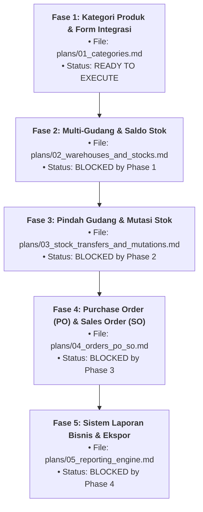

# 📋 MASTER ORCHESTRATION PLAN & ROADMAP
## Supply Chain, Multi-Gudang, Mutasi Stok, Order (PO & SO), Pindah Gudang, dan Sistem Laporan

Dokumen ini adalah **Master Dashboard & Orkestrator Utama** pengembangan sistem rantai pasok (Supply Chain & Inventory Lite) pada **GAS Modular CRUD Framework**. Dokumen ini mengoordinasikan seluruh sub-rencana granular yang dipecah per fase ke dalam folder `plans/`, memetakan dependensi antar-agen, serta menandai kesiapan eksekusi paralel vs sekuensial.

---

## 🚦 Matriks Master Orkestrasi Antar-Fase

| Fase | Nama Modul | Rencana Granular | Mode Orkestrasi | Prasyarat (Blocked By) | Status |
| :---: | :--- | :---: | :---: | :---: | :---: |
| **Fase 1** | **Kategori Produk & Integrasi Form** | [`plans/01_categories.md`](plans/01_categories.md) | **Sub-Tasks Paralel** | Tidak Ada | 🟢 `COMPLETED` |
| **Fase 2** | **Multi-Gudang & Saldo Stok** | [`plans/02_warehouses_and_stocks.md`](plans/02_warehouses_and_stocks.md) | **Sub-Tasks Paralel** | Selesai Fase 1 | 🟢 `COMPLETED` |
| **Fase 3** | **Pindah Gudang & Engine Mutasi Stok** | [`plans/03_stock_transfers_and_mutations.md`](plans/03_stock_transfers_and_mutations.md) | **Sub-Tasks Paralel** | Selesai Fase 2 | 🟢 `COMPLETED` |
| **Fase 4** | **Purchase Order (PO) & Sales Order (SO)** | [`plans/04_orders_po_so.md`](plans/04_orders_po_so.md) | **Sub-Tasks Paralel** | Selesai Fase 3 | 🟢 `COMPLETED` |
| **Fase 5** | **Sistem Laporan Bisnis & Ekspor** | [`plans/05_reporting_engine.md`](plans/05_reporting_engine.md) | **Sub-Tasks Paralel** | Selesai Fase 4 | 🟢 `READY TO EXECUTE` |

---

## 🗂️ Rincian File Plan Granular per Fase

Setiap file di dalam folder `plans/` memiliki matriks dependensi tugas mikro yang menentukan apakah suatu tugas dapat dikerjakan secara paralel oleh subagent atau harus menunggu (*sequential*):

1. **[`plans/01_categories.md`](plans/01_categories.md):**
   - **T1.1 (Sequential):** Schema Kategori & modifikasi field kategori di Produk.
   - **T1.2 (Parallel Backend):** `60_CategoryRepository.gs`, `61_CategoryService.gs`, `62_CategoryController.gs`.
   - **T1.3 (Parallel Frontend):** `Tab_Categories.html`, nav link di `Main.html`, routing di `Scripts.html`.
   - **T1.4 (Parallel Core):** `API.html` adapter & ekstensi RBAC.
   - **T1.5 (Sequential):** Integrasi dynamic select kategori di `Tab_Products.html`.
   - **T1.6 (Sequential):** Seeder sheet `Categories` di `99_Seed.gs`.
   - **T1.7 (Sequential):** Verifikasi sintaks, Clasp deploy, dan Git commit.

2. **[`plans/02_warehouses_and_stocks.md`](plans/02_warehouses_and_stocks.md):**
   - **T2.1 (Sequential):** Schema Warehouses & Stocks.
   - **T2.2 & T2.3 (Parallel Backend):** CRUD Gudang & `75_StockService.gs` (multi-warehouse balance).
   - **T2.4 & T2.5 (Parallel Frontend & API):** `Tab_Warehouses.html`, API adapter, dan RBAC.
   - **T2.6 (Sequential):** Modal rincian stok per gudang di Tab Produk.
   - **T2.7 & T2.8 (Sequential):** Seeder gudang dan verifikasi.

3. **[`plans/03_stock_transfers_and_mutations.md`](plans/03_stock_transfers_and_mutations.md):**
   - **T3.1 (Sequential):** Schema `StockTransfers`, `TransferItems`, `StockMutations`.
   - **T3.2 (Sequential Core):** `77_InventoryService.gs` (Atomic LockService untuk mutasi stok).
   - **T3.3 s.d. T3.6 (Parallel):** Backend transfer, UI `Tab_StockTransfers.html` (Tombol **Approve Kirim by Admin** & **Terima Barang by SPG**), UI `Tab_StockMutations.html`, penambahan role `spg`.
   - **T3.7 & T3.8 (Sequential):** Seeder transfer dan verifikasi siklus 2-step in-transit.

4. **[`plans/04_orders_po_so.md`](plans/04_orders_po_so.md):**
   - **T4.1 (Sequential):** Schema `Orders` & `OrderItems`.
   - **T4.2 & T4.3 (Parallel Backend):** PO Workflow (Hanya Gudang Tujuan, Approve Admin $\rightarrow$ Kirim $\rightarrow$ Terima $\rightarrow$ Stok Masuk) & SO Workflow (Validasi stok $\rightarrow$ Stok Keluar).
   - **T4.4 & T4.5 (Parallel Frontend & API):** `Tab_Orders.html` (PO View, SO View, multi-item row) & API Adapter.
   - **T4.6 & T4.7 (Sequential):** Seeder transaksi dan verifikasi.

5. **[`plans/05_reporting_engine.md`](plans/05_reporting_engine.md):**
   - **T5.1 (Sequential Core):** `90_ReportService.gs` (Aggregator Kartu Stok, Valuasi Aset, PO, SO, dan Transfer).
   - **T5.2 s.d. T5.5 (Parallel):** Report Controller, UI Dashboard `Tab_Reports.html` dengan dynamic filter, Client-side CSV Blob exporter, dan Print/PDF layout.
   - **T5.6 (Sequential):** Verifikasi kalkulasi angka dan deployment final.

---

## ⚠️ Pelacakan Utang Teknis (Technical Debt Tracker)

| Kode TD | Area Risiko | Deskripsi Potensi Masalah | Solusi / Mitigasi yang Diterapkan | Status |
| :---: | :--- | :--- | :--- | :---: |
| **TD-01** | Kuota Eksekusi GAS 6 Menit | Pemanggilan ribuan baris mutasi berpotensi timeout | Memaksimalkan RAM Caching di `10_Database.gs` dan agregasi server-side | 🟢 Mitigated |
| **TD-02** | Race Condition Stok | Dua user mengurangi stok bersamaan di gudang yang sama | Wajib `LockService.getScriptLock()` pada `InventoryService` (30 detik timeout) | 🟢 Planned |
| **TD-03** | Integritas Stok In-Transit | Barang pindah gudang mengambang sebelum sampai di toko | Mekanisme 2-Langkah: Potong stok asal saat Admin approve kirim, tambah di tujuan saat SPG terima | 🟢 Designed |
| **TD-04** | Cascading Dropdown | Form order membutuhkan pemilihan Gudang $\rightarrow$ filter Produk | Ditangani pada event listener handler tab UI tanpa merusak komponen generik | 🟢 Planned |
| **TD-05** | Ekspor File Skala Besar | Ekspor laporan PDF/Excel memakan kuota Apps Script | Menggunakan client-side CSV Blob generator & native `@media print` browser | 🟢 Planned |

---

## 🎯 Target Eksekusi Saat Ini: **FASE 5 (Sistem Laporan Bisnis & Ekspor)**
Fase 1, Fase 2, Fase 3, dan Fase 4 telah selesai sepenuhnya (commit Fase 4, deploy `@34`).
Fase 5 siap dieksekusi dengan urutan tugas:
1. `T5.1`: Backend Aggregator Service `90_ReportService.gs` (Kartu Stok, Valuasi Aset, PO, SO, Transfer, Ringkasan Eksekutif).
2. `T5.2` & `T5.3` (**Paralel**): Report Controller `92_ReportController.gs` & API Adapter `API.reports`.
3. `T5.4`: Frontend UI `Tab_Reports.html` dengan filter periode & parameter per laporan.
4. `T5.5`: Client-side CSV Blob Exporter & Native Print Layout CSS.
5. `T5.6`: Verifikasi integritas angka, Clasp push & deploy, dan Git commit.

