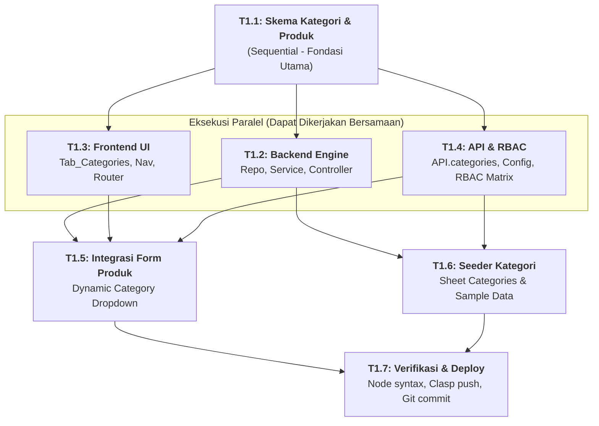

# 📦 FASE 1: Kategori Produk & Integrasi Form Produk
## File Rencana Teknis & Panduan Orkestrasi Subagent

Dokumen ini adalah panduan kerja granular untuk **Fase 1**. Dokumen ini merinci tugas mikro, dependensi antar-tugas, strategi eksekusi (paralel vs sekuensial), dan peran subagent pelaksana.

---

## 🚦 Matriks Orkestrasi Tugas (Agent Execution Graph)

| Task ID | Nama Tugas | Strategi Eksekusi | Prasyarat (Blocked By) | Agen Pelaksana | File Target | Status |
| :---: | :--- | :---: | :---: | :---: | :--- | :---: |
| **T1.1** | **Definisi Skema Kategori & Update Produk** | `SEQUENTIAL` | Tidak Ada | **Architect / Core Agent** | `01_Schema.gs`<br>`01_Schema_Frontend.html` | `[PENDING]` |
| **T1.2** | **Backend Kategori (Repo, Service, Controller)** | `PARALLEL` | **T1.1** | **Backend Subagent** | `60_CategoryRepository.gs`<br>`61_CategoryService.gs`<br>`62_CategoryController.gs` | `[PENDING]` |
| **T1.3** | **Frontend UI Tab Kategori (`Tab_Categories`)** | `PARALLEL` | **T1.1** | **Frontend Subagent** | `Tab_Categories.html`<br>`Main.html` (nav)<br>`Scripts.html` (routing) | `[PENDING]` |
| **T1.4** | **API Adapter & RBAC Extension** | `PARALLEL` | **T1.1** | **Backend / Core Subagent** | `API.html`<br>`00_Config.gs`<br>`05_RBAC.gs` | `[PENDING]` |
| **T1.5** | **Integrasi Dropdown Kategori di Form Produk** | `SEQUENTIAL` | **T1.2**, **T1.3**, **T1.4** | **Frontend Subagent** | `Tab_Products.html` | `[PENDING]` |
| **T1.6** | **Seeder & Inisialisasi Sheet `Categories`** | `SEQUENTIAL` | **T1.2**, **T1.4** | **Backend Subagent** | `99_Seed.gs` | `[PENDING]` |
| **T1.7** | **Verifikasi Sistem, Clasp Deploy & Git Commit** | `SEQUENTIAL` | **T1.5**, **T1.6** | **Main Orchestrator Agent** | Runtime Verification | `[PENDING]` |



---

## 📝 Rincian Detail Mikro-Tugas

### Task 1.1: Definisi Skema Kategori & Penyesuaian Produk (`SEQUENTIAL`)
- **Tujuan:** Menyiapkan metadata skema entitas `CategorySchema` dan menambahkan field `category_id` ke `ProductSchema`.
- **File:** `01_Schema.gs` & `01_Schema_Frontend.html`.
- **Spesifikasi Skema Kategori:**
  ```javascript
  const CategorySchema = {
    resource: 'categories',
    sheet: 'Categories',
    idField: 'id',
    idPrefix: 'CAT',
    columns: [
      { key: 'id', label: 'ID', type: 'text' },
      { key: 'code', label: 'Kode', type: 'text', searchable: true, sortable: true },
      { key: 'name', label: 'Nama Kategori', type: 'text', searchable: true, sortable: true },
      { key: 'description', label: 'Deskripsi', type: 'text' },
      { key: 'created_at', label: 'Dibuat', type: 'date' }
    ],
    form: {
      fields: [
        { key: 'code', label: 'Kode Kategori (e.g. ELK, FNB)', type: 'text', required: true },
        { key: 'name', label: 'Nama Kategori', type: 'text', required: true },
        { key: 'description', label: 'Deskripsi / Catatan', type: 'textarea' }
      ]
    }
  };
  ```
- **Penyesuaian `ProductSchema`:**
  - Tambahkan kolom `{ key: 'category_id', label: 'Kategori', type: 'badge' }`.
  - Tambahkan field formulir `{ key: 'category_id', label: 'Kategori', type: 'select', options: [], required: true }`.

---

### Task 1.2: Backend Kategori (Repo, Service, Controller) (`PARALLEL`)
- **Tujuan:** Membuat lapisan backend modular untuk entitas Categories sesuai konvensi.
- **File:**
  1. `60_CategoryRepository.gs`: Panggil `Repository.findAll(CategorySchema)`, `Repository.findById`, dll.
  2. `61_CategoryService.gs`: Validasi kode kategori unik (case-insensitive), validasi nama tidak boleh kosong.
  3. `62_CategoryController.gs`:
     - Global functions: `categoriesList(sessionToken)`, `categoriesGet(id, sessionToken)`, `categoriesCreate(data, sessionToken)`, `categoriesUpdate(id, data, sessionToken)`, `categoriesDelete(id, sessionToken)`.
     - Validasi RBAC `RBAC.authorize(sessionToken, 'categories', action)`.

---

### Task 1.3: Frontend UI Tab Kategori (`PARALLEL`)
- **Tujuan:** Membuat halaman manajemen kategori produk dengan tabel dinamis, pencarian, dan modal tambah/ubah.
- **File:**
  1. `Tab_Categories.html`: Menggunakan `Table.render` dan `Form.render` berbasis `CategorySchema`.
  2. `Main.html`: Tambahkan item navigasi `<a data-nav="categories">Kategori</a>` dan container tab `<div id="tab-categories">`.
  3. `Scripts.html`: Pasang handler navigasi dan kontrol akses UI.

---

### Task 1.4: API Adapter & RBAC Extension (`PARALLEL`)
- **Tujuan:** Menghubungkan client ke server dan memberikan hak akses default.
- **File:**
  1. `API.html`:
     ```javascript
     categories: {
       list: () => API.call('categoriesList'),
       get: (id) => API.call('categoriesGet', id),
       create: (data) => API.call('categoriesCreate', data),
       update: (id, data) => API.call('categoriesUpdate', id, data),
       delete: (id) => API.call('categoriesDelete', id)
     }
     ```
  2. `00_Config.gs`: Daftarkan hak akses `categories` pada role `admin`, `manager`, `staff`, `viewer`.
  3. `05_RBAC.gs`: Daftarkan resource `categories` pada wildcard admin dan resolusi izin.

---

### Task 1.5: Integrasi Dropdown Kategori di Form Produk (`SEQUENTIAL`)
- **Tujuan:** Memastikan modal Tambah & Edit Produk memuat opsi kategori terkini secara dinamis dari database.
- **File:** `Tab_Products.html`.
- **Implementasi:**
  - Tambahkan fungsi `prepareCategoryOptions()` yang memanggil `API.categories.list()`.
  - Isi `ProductSchema.form.fields.find(f => f.key === 'category_id').options` dengan data hasil query.
  - Panggil `prepareCategoryOptions()` sebelum membuka modal Add dan Edit.
  - Tampilkan nama kategori di tabel produk (bukan hanya ID raw).

---

### Task 1.6: Seeder Kategori di Google Sheets (`SEQUENTIAL`)
- **Tujuan:** Menyiapkan sheet `Categories` secara otomatis di Google Spreadsheet dengan data awal.
- **File:** `99_Seed.gs`.
- **Data Sampel:**
  - `CAT-000001` | `ELK` | `Elektronik` | Peralatan elektronik dan gadget
  - `CAT-000002` | `FNB` | `Food & Beverage` | Makanan dan minuman kemasan
  - `CAT-000003` | `ATK` | `Alat Tulis Kantor` | Perlengkapan operasional kantor

---

### Task 1.7: Verifikasi Sistem, Deployment & Git Commit (`SEQUENTIAL`)
- **Tujuan:** Validasi menyeluruh bebas error sintaks, deploy ke public URL via `clasp`, dan sinkronisasi ke GitHub.
- **Langkah:**
  1. Jalankan `node -e` check untuk semua file `.gs` dan script HTML.
  2. Eksekusi `clasp push -f`.
  3. Eksekusi `clasp deploy -i <DEPLOYMENT_ID> -d "feat: Phase 1 categories and product integration"`.
  4. Lakukan `git add .`, `git commit -m "feat(phase-1): add categories module and dynamic product integration"`, dan `git push origin main`.
