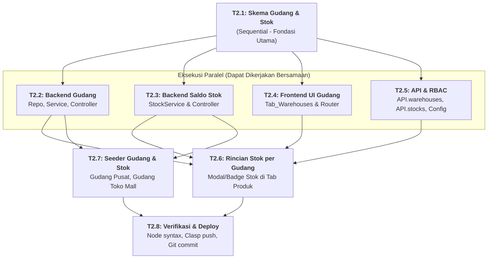

# 🏬 FASE 2: Manajemen Multi-Gudang & Saldo Stok per Lokasi
## File Rencana Teknis & Panduan Orkestrasi Subagent

Dokumen ini adalah panduan kerja granular untuk **Fase 2**. Dokumen ini merinci pengelolaan multi-gudang (pusat, cabang, toko) dan struktur saldo stok fisik per gudang (`Stocks`).

---

## 🚦 Matriks Orkestrasi Tugas (Agent Execution Graph)

| Task ID | Nama Tugas | Strategi Eksekusi | Prasyarat (Blocked By) | Agen Pelaksana | File Target | Status |
| :---: | :--- | :---: | :---: | :---: | :--- | :---: |
| **T2.1** | **Definisi Skema Gudang & Saldo Stok** | `SEQUENTIAL` | Selesai Fase 1 | **Architect / Core Agent** | `01_Schema.gs` `01_Schema_Frontend.html` | `[PENDING]` |
| **T2.2** | **Backend Gudang (Repo, Service, Controller)** | `PARALLEL` | **T2.1** | **Backend Subagent** | `70_WarehouseRepository.gs` `71_WarehouseService.gs` `72_WarehouseController.gs` | `[PENDING]` |
| **T2.3** | **Backend Saldo Stok (`StockService`)** | `PARALLEL` | **T2.1** | **Backend Subagent** | `75_StockService.gs` `75_StockController.gs` | `[PENDING]` |
| **T2.4** | **Frontend UI Tab Gudang (`Tab_Warehouses`)** | `PARALLEL` | **T2.1** | **Frontend Subagent** | `Tab_Warehouses.html` `Main.html` (nav) `Scripts.html` (router) | `[PENDING]` |
| **T2.5** | **API Adapter & RBAC Extension** | `PARALLEL` | **T2.1** | **Backend / Core Subagent** | `API.html` `00_Config.gs` `05_RBAC.gs` | `[PENDING]` |
| **T2.6** | **Tampilan Rincian Stok Gudang di Tab Produk** | `SEQUENTIAL` | **T2.3**, **T2.4**, **T2.5** | **Frontend Subagent** | `Tab_Products.html` | `[PENDING]` |
| **T2.7** | **Seeder Gudang & Inisialisasi Sheet `Stocks`** | `SEQUENTIAL` | **T2.2**, **T2.3**, **T2.5** | **Backend Subagent** | `99_Seed.gs` | `[PENDING]` |
| **T2.8** | **Verifikasi Sistem, Clasp Deploy & Git Commit** | `SEQUENTIAL` | **T2.6**, **T2.7** | **Main Orchestrator Agent** | Runtime Verification | `[PENDING]` |

---

## 📝 Rincian Detail Mikro-Tugas

### Task 2.1: Definisi Skema Gudang & Saldo Stok (`SEQUENTIAL`)
- **`WarehouseSchema`:**
  - Resource: `warehouses`, Sheet: `Warehouses`, Prefix: `WH`.
  - Kolom: `id`, `code` (misal `GDG-PUSAT`, `TOKO-MALL`), `name`, `address`, `status` (`active`/`inactive`), `created_at`.
- **`StockSchema`:**
  - Resource: `stocks`, Sheet: `Stocks`, Prefix: `STK`.
  - Kolom: `id`, `warehouse_id`, `product_id`, `quantity`, `updated_at`.

### Task 2.2: Backend Gudang (`PARALLEL`)
- `70_WarehouseRepository.gs`: Panggilan generic Repository untuk sheet `Warehouses`.
- `71_WarehouseService.gs`: Validasi kode gudang unik, pencegahan hapus gudang jika masih memiliki stok > 0.
- `72_WarehouseController.gs`: Endpoints `warehousesList`, `warehousesGet`, `warehousesCreate`, `warehousesUpdate`, `warehousesDelete` dengan proteksi RBAC.

### Task 2.3: Backend Saldo Stok (`PARALLEL`)
- `75_StockService.gs`:
  - `getBalance(warehouseId, productId)`: Mendapatkan stok produk di gudang spesifik.
  - `getByProduct(productId)`: Mendapatkan rincian stok produk di seluruh gudang.
  - `getByWarehouse(warehouseId)`: Mendapatkan seluruh stok barang di satu gudang.
  - `recalculateTotalProductStock(productId)`: Menjumlahkan saldo seluruh gudang dan mengupdate kolom `stock` di sheet `Products`.
- `75_StockController.gs`: Endpoints `stocksList()`, `stocksGetByProduct(productId)`, `stocksGetByWarehouse(warehouseId)`.

### Task 2.4: Frontend UI Tab Gudang (`PARALLEL`)
- `Tab_Warehouses.html`: Daftar tabel gudang, badge status aktif/nonaktif, modal Tambah & Edit Gudang.
- Registrasi nav link di `Main.html` dan routing di `Scripts.html`.

### Task 2.5: API Adapter & RBAC Extension (`PARALLEL`)
- `API.html`: Daftarkan `API.warehouses` dan `API.stocks`.
- Daftarkan resource `warehouses` dan `stocks` di `00_Config.gs` dan `05_RBAC.gs`.

### Task 2.6: Tampilan Rincian Stok Gudang di Tab Produk (`SEQUENTIAL`)
- Di `Tab_Products.html`, tambahkan tombol/aksi "Lihat Stok per Gudang" pada setiap baris produk.
- Menampilkan modal popup ringkasan:
  - Gudang Pusat: `120 pcs`
  - Toko Mall: `35 pcs`
  - Total Konsolidasi: `155 pcs`

### Task 2.7: Seeder Gudang & Inisialisasi Sheet `Stocks` (`SEQUENTIAL`)
- Inisialisasi data awal di `99_Seed.gs`:
  - `WH-000001` | `GDG-JKT` | `Gudang Pusat Jakarta` | Jl. Daan Mogot No. 10 | `active`
  - `WH-000002` | `TKO-MALL` | `Toko Mall Kelapa Gading` | Mall Kelapa Gading Lt. 2 | `active`
  - Inisialisasi stok awal untuk produk sampel pada sheet `Stocks`.

### Task 2.8: Verifikasi & Deploy (`SEQUENTIAL`)
- Syntax validation via `node -e`.
- `clasp push -f` & deployment versioning.
- Git commit & push.
