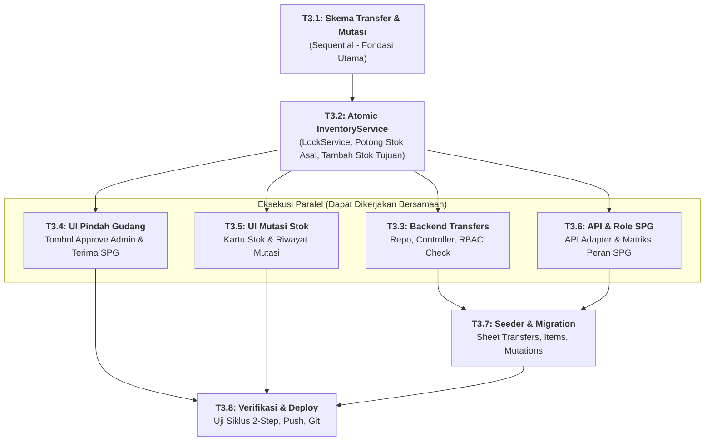

# 🚚 FASE 3: Pindah Gudang (Approval Berjenjang) & Engine Mutasi Stok
## File Rencana Teknis & Panduan Orkestrasi Subagent

Dokumen ini adalah panduan kerja granular untuk **Fase 3**. Dokumen ini merinci alur transfer stok antar-gudang (Gudang Asal $\rightarrow$ Gudang Tujuan), mekanisme 2-Langkah (*Approve Kirim by Admin* $\rightarrow$ *Terima Barang by SPG*), serta pencatatan mutasi stok atomik menggunakan `LockService`.

---

## 🚦 Matriks Orkestrasi Tugas (Agent Execution Graph)

| Task ID | Nama Tugas | Strategi Eksekusi | Prasyarat (Blocked By) | Agen Pelaksana | File Target | Status |
| :---: | :--- | :---: | :---: | :---: | :--- | :---: |
| **T3.1** | **Definisi Skema Pindah Gudang & Mutasi** | `SEQUENTIAL` | Selesai Fase 2 | **Architect / Core Agent** | `01_Schema.gs`<br>`01_Schema_Frontend.html` | `[PENDING]` |
| **T3.2** | **Core Atomic Engine (`77_InventoryService`)** | `SEQUENTIAL` | **T3.1** | **Backend Core Subagent** | `77_InventoryService.gs` | `[PENDING]` |
| **T3.3** | **Backend Pindah Gudang (Repo & Controller)** | `PARALLEL` | **T3.2** | **Backend Subagent** | `76_StockTransferRepository.gs`<br>`78_StockTransferController.gs` | `[PENDING]` |
| **T3.4** | **Frontend UI Pindah Gudang (`Tab_StockTransfers`)** | `PARALLEL` | **T3.2** | **Frontend Subagent** | `Tab_StockTransfers.html`<br>`Main.html` (nav)<br>`Scripts.html` (router) | `[PENDING]` |
| **T3.5** | **Frontend UI Riwayat Mutasi (`Tab_StockMutations`)** | `PARALLEL` | **T3.2** | **Frontend Subagent** | `Tab_StockMutations.html`<br>`Main.html` (nav) | `[PENDING]` |
| **T3.6** | **API Adapter & RBAC Extension (Role SPG)** | `PARALLEL` | **T3.2** | **Backend / Core Subagent** | `API.html`<br>`00_Config.gs`<br>`05_RBAC.gs` | `[PENDING]` |
| **T3.7** | **Seeder Pindah Gudang & Migration Sheets** | `SEQUENTIAL` | **T3.3**, **T3.6** | **Backend Subagent** | `99_Seed.gs` | `[PENDING]` |
| **T3.8** | **Verifikasi Alur Approval, Deploy & Commit** | `SEQUENTIAL` | **T3.4**, **T3.5**, **T3.7** | **Main Orchestrator Agent** | Runtime Verification | `[PENDING]` |



---

## 📝 Rincian Detail Mikro-Tugas

### Task 3.1: Definisi Skema Pindah Gudang & Mutasi (`SEQUENTIAL`)
- **`StockTransferSchema` (`TRF-000001`):**
  - Kolom: `id`, `transfer_no`, `date`, `source_warehouse_id` (Gudang Asal), `destination_warehouse_id` (Gudang Tujuan), `status` (`draft`, `approved_shipped`, `received`, `cancelled`), `approved_by`, `approved_at`, `received_by`, `received_at`, `notes`.
- **`TransferItemSchema` (`TFI-000001`):**
  - Kolom: `id`, `transfer_id`, `product_id`, `quantity`.
- **`StockMutationSchema` (`MUT-000001`):**
  - Kolom: `id`, `date`, `type` (`IN`, `OUT`, `TRANSFER_OUT`, `TRANSFER_IN`, `ADJUSTMENT`), `reference_type` (`TRANSFER`, `PO`, `SO`, `OPNAME`), `reference_id`, `product_id`, `warehouse_id`, `quantity`, `notes`, `created_by`.

---

### Task 3.2: Core Atomic Inventory Engine (`77_InventoryService.gs`) (`SEQUENTIAL`)
- **Karakteristik Kunci:** Seluruh mutasi dibungkus `LockService.getScriptLock()` dengan timeout 30 detik untuk menjamin konsistensi data absolut.
- **Method Kunci:**
  1. `recordTransferDraft(data, items)`: Simpan dokumen transfer dalam status `draft`.
  2. `approveTransferSend(transferId, sessionUser)`:
     - Hanya boleh dieksekusi oleh user dengan izin approval (Admin/Manager).
     - Validasi stok fisik di `source_warehouse_id`. Jika stok kurang, lemparkan Error.
     - **Potong stok seketika di Gudang Asal**.
     - Catat mutasi: `type: 'TRANSFER_OUT'`, `warehouse_id: source_warehouse_id`.
     - Ubah status transfer menjadi `approved_shipped` (*in-transit*).
     - Rekam `approved_by` dan `approved_at`.
  3. `receiveTransfer(transferId, sessionUser)`:
     - Hanya boleh dieksekusi oleh penerima di gudang tujuan (SPG/Staff).
     - **Tambah stok di Gudang Tujuan (`destination_warehouse_id`)**.
     - Catat mutasi: `type: 'TRANSFER_IN'`, `warehouse_id: destination_warehouse_id`.
     - Ubah status transfer menjadi `received` (*completed*).
     - Rekam `received_by` dan `received_at`.
  4. Invalidate RAM Cache untuk sheet `Stocks`, `StockMutations`, `StockTransfers`, dan `Products`.

---

### Task 3.3: Backend Pindah Gudang (Repo & Controller) (`PARALLEL`)
- `76_StockTransferRepository.gs`: Akses CRUD sheet `StockTransfers` dan `TransferItems`.
- `78_StockTransferController.gs`:
  - `transfersList(sessionToken)`: Mengambil daftar transfer (dapat difilter per gudang).
  - `transfersCreate(data, sessionToken)`: Membuat draft transfer.
  - `transfersApproveSend(id, sessionToken)`: Otorisasi Admin $\rightarrow$ eksekusi `InventoryService.approveTransferSend`.
  - `transfersReceive(id, sessionToken)`: Otorisasi SPG/Staff $\rightarrow$ eksekusi `InventoryService.receiveTransfer`.
  - `mutationsList(filter, sessionToken)`: Mengambil riwayat mutasi stok.

---

### Task 3.4: Frontend UI Pindah Gudang (`Tab_StockTransfers.html`) (`PARALLEL`)
- **Tampilan Daftar Transfer:**
  - Menampilkan kolom: No Transfer, Tanggal, Gudang Asal $\rightarrow$ Gudang Tujuan, Qty Total, Status Badge, Aksi.
- **Aksi Cerdas Sesuai Peran & Status:**
  - Jika Status `draft` & User adalah **Admin**: Tampilkan tombol hijau **"Approve Kirim"**.
  - Jika Status `approved_shipped` & User adalah **SPG / Staff Gudang Tujuan**: Tampilkan tombol biru **"Konfirmasi Terima"**.
  - Jika Status `received`: Tampilkan badge hijau *Selesai*.
- Modal Form Pengajuan Transfer dengan pemilihan Gudang Asal, Gudang Tujuan, dan daftar multi-item produk.

---

### Task 3.5: Frontend UI Riwayat Mutasi (`Tab_StockMutations.html`) (`PARALLEL`)
- Tampilan kartu stok (*Stock Ledger*).
- Filter berdasarkan Gudang, Produk, Tanggal, dan Jenis Mutasi.
- Badge warna: Hijau (`IN`, `TRANSFER_IN`), Merah (`OUT`, `TRANSFER_OUT`), Biru (`ADJUSTMENT`).

---

### Task 3.6: API Adapter & Penambahan Peran SPG (`PARALLEL`)
- `API.html`: Daftarkan `API.transfers` dan `API.mutations`.
- `00_Config.gs`:
  - Tambahkan peran `spg`:
    ```javascript
    spg: {
      name: 'SPG / Staff Toko',
      permissions: {
        products: ['read'],
        stocks: ['read'],
        transfers: ['read', 'create', 'receive'], // Khusus Terima Barang
        orders: ['read', 'create'],
        dashboard: ['read']
      }
    }
    ```
- `05_RBAC.gs`: Penyesuaian pemeriksaan hak akses `transfers:approve` dan `transfers:receive`.

---

### Task 3.7: Seeder & Migration (`SEQUENTIAL`)
- Inisialisasi sheet `StockTransfers`, `TransferItems`, dan `StockMutations` di `99_Seed.gs`.
- Seeder akun uji coba: `spg@example.com` (password: `spg123`, role: `spg`).

---

### Task 3.8: Verifikasi Siklus Pindah Gudang & Deploy (`SEQUENTIAL`)
- Simulasi alur lengkap:
  1. Staff mengajukan transfer 10 pcs dari Gudang Pusat ke Toko Mall.
  2. Login Admin $\rightarrow$ Klik "Approve Kirim" $\rightarrow$ Pastikan stok Gudang Pusat berkurang 10.
  3. Login SPG $\rightarrow$ Klik "Konfirmasi Terima" $\rightarrow$ Pastikan stok Toko Mall bertambah 10.
  4. Periksa `StockMutations` $\rightarrow$ Pastikan ada 2 entri (`TRANSFER_OUT` & `TRANSFER_IN`).
- Deploy versi baru via Clasp & push ke GitHub.
