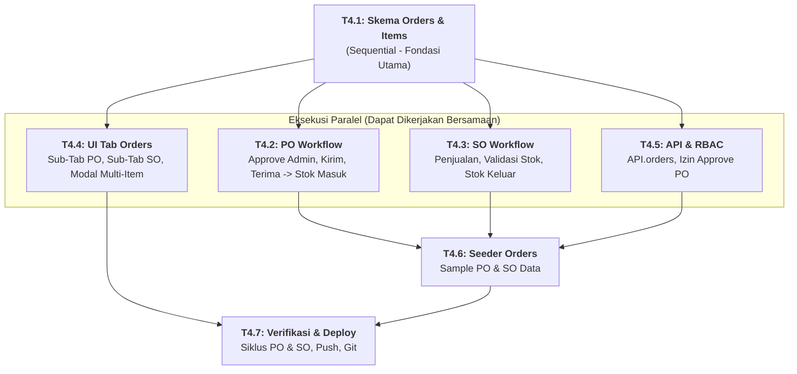

# 🛒 FASE 4: Transaksi Purchase Order (PO) & Sales Order (SO)
## File Rencana Teknis & Panduan Orkestrasi Subagent

Dokumen ini adalah panduan kerja granular untuk **Fase 4**. Dokumen ini merinci alur transaksi pengadaan barang (Purchase Order / PO) dengan persetujuan Admin dan penerimaan gudang, serta transaksi penjualan (Sales Order / SO) yang terintegrasi otomatis dengan mutasi saldo stok.

---

## 🚦 Matriks Orkestrasi Tugas (Agent Execution Graph)

| Task ID | Nama Tugas | Strategi Eksekusi | Prasyarat (Blocked By) | Agen Pelaksana | File Target | Status |
| :---: | :--- | :---: | :---: | :---: | :--- | :---: |
| **T4.1** | **Definisi Skema Orders & OrderItems** | `SEQUENTIAL` | Selesai Fase 3 | **Architect / Core Agent** | `01_Schema.gs` `01_Schema_Frontend.html` | 🟢 `[COMPLETED]` |
| **T4.2** | **Backend Purchase Order Workflow** | `PARALLEL` | **T4.1** | **Backend Subagent** | `80_OrderRepository.gs` `81_OrderService.gs` `82_OrderController.gs` | 🟢 `[COMPLETED]` |
| **T4.3** | **Backend Sales Order Workflow** | `PARALLEL` | **T4.1** | **Backend Subagent** | `81_OrderService.gs` `82_OrderController.gs` | 🟢 `[COMPLETED]` |
| **T4.4** | **Frontend UI Tab Orders (`Tab_Orders`)** | `PARALLEL` | **T4.1** | **Frontend Subagent** | `Tab_Orders.html` `Main.html` (nav) `Scripts.html` (router) | 🟢 `[COMPLETED]` |
| **T4.5** | **API Adapter & RBAC Extension** | `PARALLEL` | **T4.1** | **Backend / Core Subagent** | `API.html` `00_Config.gs` `05_RBAC.gs` | 🟢 `[COMPLETED]` |
| **T4.6** | **Seeder Orders & OrderItems** | `SEQUENTIAL` | **T4.2**, **T4.3**, **T4.5** | **Backend Subagent** | `99_Seed.gs` | 🟢 `[COMPLETED]` |
| **T4.7** | **Verifikasi Transaksi, Deploy & Commit** | `SEQUENTIAL` | **T4.4**, **T4.6** | **Main Orchestrator Agent** | Runtime Verification | 🟢 `[COMPLETED]` |

---

## 📝 Rincian Detail Mikro-Tugas

### Task 4.1: Definisi Skema Orders & OrderItems (`SEQUENTIAL`)
- **`OrderSchema`:**
  - Resource: `orders`, Sheet: `Orders`, Prefix: `ORD` (atau `PO` / `SO`).
  - Kolom:
    - `id`, `order_no`, `type` (`PURCHASE` / `SALES`), `date`.
    - `destination_warehouse_id`: **Hanya Gudang Tujuan** untuk PO; Gudang Pengirim untuk SO.
    - `contact_name`: Nama Pemasok (PO) atau Pelanggan (SO).
    - `total_amount`: Akumulasi nilai uang.
    - `status`:
      - Siklus PO: `draft` $\rightarrow$ `approved` $\rightarrow$ `shipped` $\rightarrow$ `received` (atau `cancelled`).
      - Siklus SO: `draft` $\rightarrow$ `completed` (atau `cancelled`).
    - `approved_by`, `approved_at`, `received_by`, `received_at`, `notes`, `created_by`.
- **`OrderItemSchema`:**
  - Resource: `order_items`, Sheet: `OrderItems`, Prefix: `ITM`.
  - Kolom: `id`, `order_id`, `product_id`, `quantity`, `price`, `subtotal`.

---

### Task 4.2: Backend Purchase Order Workflow (`PARALLEL`)
- **Implementasi Khusus PO:**
  1. `createPurchaseDraft(data, items)`: Menyimpan draft PO dengan target `destination_warehouse_id`.
  2. `approvePurchase(orderId, sessionUser)`:
     - Otorisasi: Wajib peran **Admin** (`orders:approve`).
     - Mengubah status PO menjadi `approved`.
     - Mencatat `approved_by` dan `approved_at`.
  3. `markPurchaseShipped(orderId)`:
     - Mengubah status PO menjadi `shipped` (barang dalam perjalanan dari supplier).
  4. `receivePurchase(orderId, sessionUser)`:
     - Dilindungi `LockService.getScriptLock()`.
     - Mengubah status PO menjadi `received`.
     - Menambah kuantitas stok di `destination_warehouse_id` untuk seluruh item barang.
     - Mencatat mutasi di `StockMutations`: `type: 'IN'`, `reference_type: 'PO'`, `reference_id: orderId`.
     - Menghitung ulang total agregat stok produk di `Products`.
     - Mencatat `received_by` dan `received_at`.

---

### Task 4.3: Backend Sales Order Workflow (`PARALLEL`)
- **Implementasi Khusus SO:**
  1. `createSalesOrder(data, items)`:
     - Dilindungi `LockService.getScriptLock()`.
     - Memeriksa ketersediaan stok fisik di gudang pengirim untuk seluruh item.
     - Jika stok kurang: Batalkan dengan pesan error yang jelas.
     - Jika stok cukup: Potong stok di gudang pengirim.
     - Catat mutasi di `StockMutations`: `type: 'OUT'`, `reference_type: 'SO'`, `reference_id: orderId`.
     - Simpan order dengan status `completed`.

---

### Task 4.4: Frontend UI Tab Orders (`Tab_Orders.html`) (`PARALLEL`)
- Tampilan dua tab bersarang: **Pembelian (PO)** dan **Penjualan (SO)**.
- **Fitur PO:**
  - Form Pembuatan PO: Pemilihan Supplier, Tanggal, **Gudang Tujuan Saja**, dan tabel dinamis tambah item barang (Produk, Qty, Harga Beli, Subtotal).
  - Tombol Aksi Kontekstual:
    - Jika Status `draft`: Tombol **"Approve PO"** (hanya terlihat jika user adalah Admin).
    - Jika Status `approved`: Tombol **"Barang Dikirim"**.
    - Jika Status `shipped`: Tombol **"Konfirmasi Terima Barang"** (memicu stok masuk).
- **Fitur SO:**
  - Form Penjualan: Pemilihan Customer, Gudang Pengirim, Item Barang, perhitungan total otomatis.

---

### Task 4.5: API Adapter & RBAC Extension (`PARALLEL`)
- `API.html`:
  - `API.orders.list(type)`
  - `API.orders.createPurchase(data, items)`
  - `API.orders.approvePurchase(id)`
  - `API.orders.shipPurchase(id)`
  - `API.orders.receivePurchase(id)`
  - `API.orders.createSales(data, items)`
- RBAC: Menambahkan permission `orders:approve` khusus Admin di `00_Config.gs` dan `05_RBAC.gs`.

---

### Task 4.6: Seeder Orders & Migration (`SEQUENTIAL`)
- Inisialisasi sheet `Orders` dan `OrderItems` di `99_Seed.gs`.
- Data contoh 1 transaksi PO berstatus `received` dan 1 transaksi SO berstatus `completed`.

---

### Task 4.7: Verifikasi & Deployment (`SEQUENTIAL`)
- Simulasi pengerjaan siklus PO penuh: Draft $\rightarrow$ Approve Admin $\rightarrow$ Kirim $\rightarrow$ Terima $\rightarrow$ Cek saldo stok bertambah.
- Simulasi SO $\rightarrow$ Cek saldo stok berkurang.
- Push & deploy via Clasp, commit ke Git.
