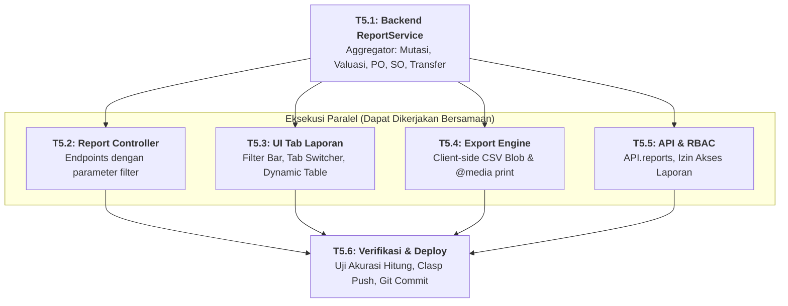

# 📊 FASE 5: Sistem Laporan Bisnis Komprehensif & Ekspor Data
## File Rencana Teknis & Panduan Orkestrasi Subagent

Dokumen ini adalah panduan kerja granular untuk **Fase 5**. Dokumen ini merinci pembangunan Reporting Engine yang mengagregasikan data inventaris, mutasi stok, pembelian, penjualan, dan rekap transfer antar-gudang, lengkap dengan fitur ekspor CSV client-side dan format siap cetak (Print / PDF).

---

## 🚦 Matriks Orkestrasi Tugas (Agent Execution Graph)

| Task ID | Nama Tugas | Strategi Eksekusi | Prasyarat (Blocked By) | Agen Pelaksana | File Target | Status |
| :---: | :--- | :---: | :---: | :---: | :--- | :---: |
| **T5.1** | **Backend Reporting Engine (`ReportService`)** | `SEQUENTIAL` | Selesai Fase 4 | **Backend Core Subagent** | `90_ReportService.gs` | `[PENDING]` |
| **T5.2** | **Backend Report Controller & Endpoints** | `PARALLEL` | **T5.1** | **Backend Subagent** | `91_ReportController.gs` | `[PENDING]` |
| **T5.3** | **Frontend UI Tab Laporan (`Tab_Reports`)** | `PARALLEL` | **T5.1** | **Frontend Subagent** | `Tab_Reports.html` `Main.html` (nav) `Scripts.html` (router) | `[PENDING]` |
| **T5.4** | **Client-Side Export Engine (CSV & Print PDF)** | `PARALLEL` | **T5.1** | **Frontend Subagent** | `Component_Export.html` (atau inline util) | `[PENDING]` |
| **T5.5** | **API Adapter & RBAC Extension** | `PARALLEL` | **T5.1** | **Backend / Core Subagent** | `API.html` `00_Config.gs` `05_RBAC.gs` | `[PENDING]` |
| **T5.6** | **Verifikasi Agregasi Data, Deploy & Commit** | `SEQUENTIAL` | **T5.2**, **T5.3**, **T5.4**, **T5.5** | **Main Orchestrator Agent** | Runtime Verification | `[PENDING]` |

---

## 📝 Rincian Detail Mikro-Tugas

### Task 5.1: Backend Reporting Engine (`90_ReportService.gs`) (`SEQUENTIAL`)
- **Fungsi Agregasi Data:**
  1. `getStockCardReport(params)`:
     - Mengambil seluruh riwayat `StockMutations` berdasarkan rentang tanggal, filter produk, dan filter gudang.
     - Menghitung saldo berjalan (*running balance*): Saldo Awal + Masuk - Keluar = Saldo Akhir.
  2. `getStockValuationReport(params)`:
     - Menggabungkan data `Stocks` dan `Products`.
     - Menghitung `Nilai Aset = Quantity x cost_price`.
     - Menyediakan total konsolidasi nilai rupiah per gudang dan total seluruh aset perusahaan.
  3. `getPurchaseReport(params)`:
     - Rekap pesanan PO berdasarkan rentang tanggal, supplier, status, dan gudang penerima.
  4. `getSalesReport(params)`:
     - Rekap pesanan SO berdasarkan rentang tanggal, customer, status, dan omzet total.
  5. `getTransferReport(params)`:
     - Rekap mutasi antar-gudang (status `approved_shipped` vs `received`).

---

### Task 5.2: Backend Report Controller (`91_ReportController.gs`) (`PARALLEL`)
- Global functions:
  - `reportsStockCard(params, sessionToken)`
  - `reportsStockValuation(params, sessionToken)`
  - `reportsPurchases(params, sessionToken)`
  - `reportsSales(params, sessionToken)`
  - `reportsTransfers(params, sessionToken)`
- Otorisasi RBAC: `RBAC.authorize(sessionToken, 'reports', 'read')`.

---

### Task 5.3: Frontend UI Tab Laporan (`Tab_Reports.html`) (`PARALLEL`)
- **Panel Filter Dinamis:**
  - Pilihan Jenis Laporan (Kartu Stok, Valuasi, Pembelian, Penjualan, Transfer).
  - Input Tanggal Mulai (`from_date`) & Tanggal Selesai (`to_date`).
  - Dropdown Gudang & Dropdown Kategori / Produk.
  - Tombol **"Terapkan Filter"**.
- **Area Ringkasan Kartu KPI (Cards):**
  - Total Qty Masuk / Keluar.
  - Total Nilai Aset Inventaris (Rp).
  - Total Nilai Pembelian / Omzet Penjualan (Rp).
- **Tabel Hasil Laporan:** Tampilan interaktif dengan sorting dan format mata uang Rupiah (`Rp xxx.xxx`).

---

### Task 5.4: Client-Side Export Engine (`PARALLEL`)
- **Download CSV Native:**
  - Mengonversi data tabel menjadi format teks Comma-Separated Values.
  - Menggunakan `URL.createObjectURL(new Blob([csvContent], { type: 'text/csv;charset=utf-8;' }))`.
  - Mengunduh otomatis ke browser pengguna tanpa mengonsumsi kuota eksekusi Google Apps Script!
- **Tampilan Cetak / Print to PDF:**
  - Tombol **"Cetak Laporan"** yang memicu `window.print()`.
  - CSS `@media print` yang otomatis menyembunyikan sidebar navigasi, header, dan filter bar, menyisakan kertas kerja laporan bersih lengkap dengan kop dokumen dan tanggal cetak.

---

### Task 5.5: API Adapter & RBAC Extension (`PARALLEL`)
- Daftarkan `API.reports` pada `API.html`.
- Konfigurasi izin `reports: ['read', 'export']` pada role `admin` dan `manager`.

---

### Task 5.6: Verifikasi & Deployment Akhir (`SEQUENTIAL`)
- Uji kecocokan angka kalkulasi laporan dengan transaksi nyata di spreadsheet.
- Verifikasi ekspor CSV dan preview print.
- Jalankan `clasp push -f` dan buat rilis deployment final.
- Git commit & push ke GitHub.
